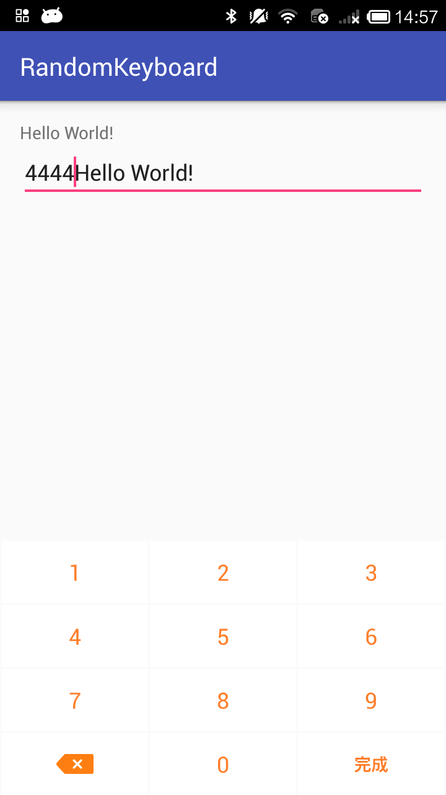
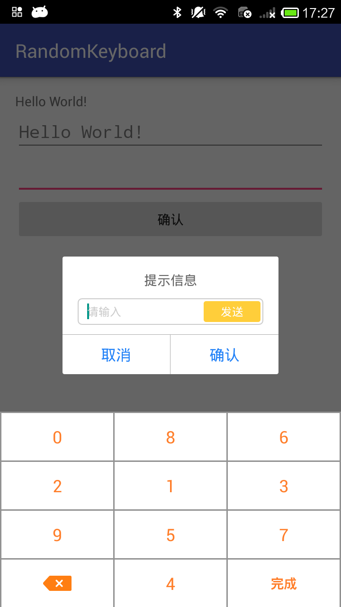

# randomkeyboard

[](https://jitpack.io/#shibenli/randomkeyboard)

基于PopWindow封装的自定义键盘，支持随机键值

### 主要有一下优点：

1、纯数字的自定义键盘；

2、使用助手类的方式，可以使用一个对象管理多个输入框；

3、不依赖于页面布局，使用内部使用Popwindow的方式实现键盘弹出，更加模块化。

4、建议使用源码的Module的方式引入，方便修改样式；

### 使用方式

1、导入Module；

2、在对应的view初始化的时候加入以下代码：

-	普通的Activity或者Fragment中使用
```
keyboardHelper = new KeyboardHelper(this)
		.addEditText((EditText) findViewById(R.id.edittext1))
		.addEditText((EditText) findViewById(R.id.edittext2))
		.setShouldRandom(true);
```


-	Dialog中使用（当然这里是返回Dialog直接findView的方式，但是你只要通过addEditText设置都行）
```
Window window = alertDialog.getWindow();
final EditText edtWithdrawCashDynamicCode = (EditText) window.findViewById(R.id.edt_withdraw_cash_dynamic_code);
keyboardHelper.addEditText(edtWithdrawCashDynamicCode);
```

###普通EditText
 

###包含EditText的Dialog
 
